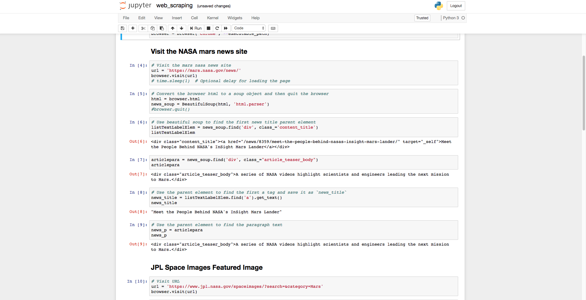
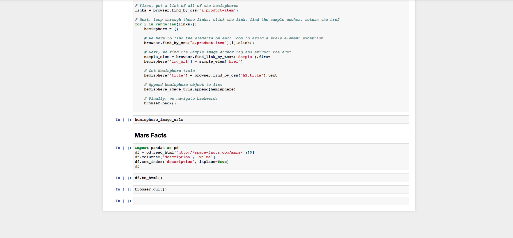
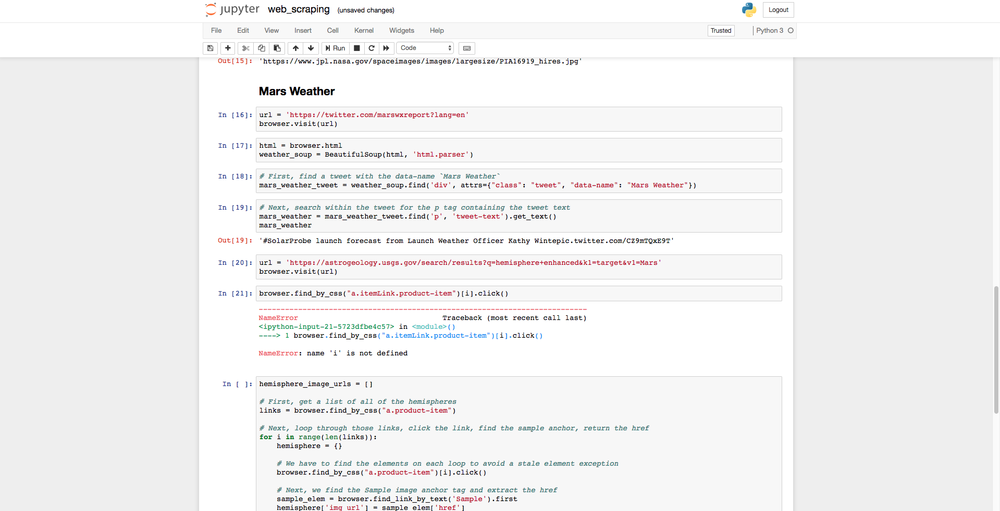

In this project I used Chromedriver and Beautiful Soup to scrape HTML and CSS elements from a Nasa website to gather picture URls, news headlines and other information and compiled in into a data file.

